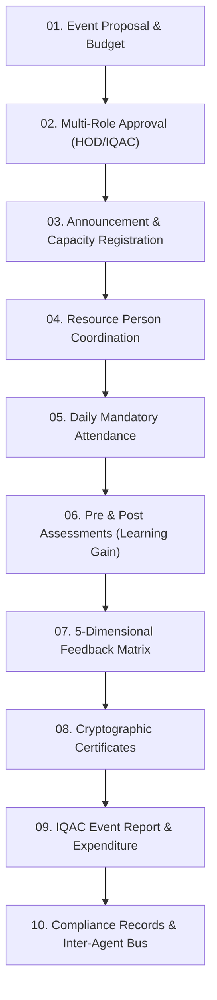

# FacultyForge AI — Agent 27 (Faculty Development Programme & Workshop Agent)
## Complete Architecture, Technology Stack & Feature Guide

---

## 1. Executive Summary: What Are We Building?

**FacultyForge AI** is an enterprise-grade autonomous academic intelligence platform designed for higher education institutions, engineering colleges, and universities. 

At the center of this platform is **Agent 27: Faculty Development Programme and Workshop Agent**.

### The Real-World Problem It Solves:
In conventional colleges and universities:
- Faculty development programmes (FDPs), workshops, and seminars are managed haphazardly across paper forms, spreadsheets, and isolated emails.
- Accreditation agencies (such as **NAAC Criterion 6.3.2/6.3.3** and **NBA Criteria 5 & 6**) demand rigorous proof of faculty training hours, learning impact, and financial statements.
- Institutional Quality Assurance Cells (**IQAC**) struggle to track whether faculty meet mandatory training norms (e.g., AICTE 40-hour annual requirements).
- Paper certificates are prone to fraud, and learning gains from workshops are rarely measured empirically.

### The Agent 27 Solution:
**Agent 27** provides an end-to-end autonomous lifecycle that automates every single phase of faculty training:
1. **Proposal & Budget Routing** with HOD and IQAC approval workflows.
2. **Registration & Capacity Gates** with automated eligibility filtering.
3. **Resource Person Logistics** managing invitations, travel, honoraria, and session kits.
4. **Mandatory Daily Attendance** tracking for funded programmes.
5. **Pre & Post Assessments** calculating normalized empirical **Learning Gain ($\Delta$ pp)**.
6. **5-Dimensional Structured Feedback** measuring content, delivery, relevance, practical value, and organization.
7. **Cryptographic Certificate Generation** embedded with tamper-proof verification tokens and instant public verification.
8. **IQAC & Funding Agency Event Dossiers** with itemized expenditure statements.
9. **Faculty Digital Passports** tracking cumulative hours against regulatory thresholds.
10. **Inter-Agent Integration Bus** streaming real-time verified payloads to downstream governance agents (**Agents 9, 57, 58, 59, 60, and 62**).

---

## 2. Technology Stack

The platform is designed with a modern, high-performance, decoupled client-server architecture:

```
+-------------------------------------------------------------------------+
|                           FACULTYFORGE AI                               |
+-------------------------------------------------------------------------+
|  FRONTEND LAYER                |  BACKEND LAYER       |  AI / AGENT BUS  |
|  - React 19 (SPA)              |  - FastAPI (Python)  |  - Hybrid Engine|
|  - Vite 8.x (Bundler & Dev)    |  - Pydantic v2       |    * Deterministic|
|  - React Router DOM v7         |  - SQLAlchemy ORM    |    * Gemini LLM  |
|  - Vanilla CSS Design System   |  - Uvicorn ASGI      |  - Multi-Agent   |
|  - Lucide React Icon Suite     |  - SQLite Database   |    Orchestrator  |
+-------------------------------------------------------------------------+
```

### Frontend Technology:
- **Framework**: **React 19** (`react`, `react-dom` v19.2) utilizing modern hooks, context providers, and clean component isolation.
- **Build Tool**: **Vite 8** (`@vitejs/plugin-react`) offering instant hot module replacement (HMR), tree-shaking, and sub-second production builds (500ms).
- **Navigation & Routing**: **React Router DOM v7** (`react-router-dom` v7.18) with nested layouts, parameter matching, and authenticated routes.
- **Iconography**: **Lucide React** (`lucide-react` v1.44) providing accessible SVG iconography.
- **Styling Architecture**: **Pure Vanilla CSS Design System** (`frontend/src/index.css`):
  - Zero heavy utility dependencies (no Tailwind bloat).
  - Centralized CSS Custom Properties (Tokens) for colors, radii, shadows, and typography.
  - Cyber-HUD Glassmorphism styling (`.agent27-hud-card`, `.agent27-scanline`, `.agent27-tag-pill`).
  - Hardware-accelerated CSS Keyframe Animations (`zoomEntrance`, `scanline`, `pulseGlow`, `dataFlicker`).

### Backend Technology:
- **Language**: **Python 3.10+** for strong typing and AI library compatibility.
- **Web API Framework**: **FastAPI** (`fastapi`):
  - Asynchronous ASGI framework for high throughput.
  - Automatic OpenAPI / Swagger interactive documentation at `/docs`.
- **Data Validation & Schemas**: **Pydantic v2** (`pydantic`, `pydantic[email]`):
  - Strict type checking and request payload sanitization.
  - Clear JSON error formatting.
- **ORM & Database**: **SQLAlchemy** (`sqlalchemy`):
  - Object-Relational Mapping with declarative base models.
  - Relationships with cascading rules and foreign key integrity.
  - Default database: **SQLite** (`facultyforge.db`), lightweight, zero-configuration, and fully local.
- **ASGI Server**: **Uvicorn** (`uvicorn`):
  - Fast ASGI server running locally on `http://127.0.0.1:8000`.

### Intelligence & AI Multi-Agent Layer:
- **Dual-Engine Design**:
  1. **Deterministic Expert Engine**: Fast, dependable statistical algorithms ensuring 100% test reliability and zero-cost operation offline.
  2. **Generative LLM Engine**: Connected to Google Gemini API (`gemini-1.5-flash` or `gemini-1.5-pro`) via the official Google GenAI SDK for synthesizing FDP proposals, drafting agendas, and summarizing feedback.

---

## 3. Official Specification of Agent 27

| Attribute | Specification |
|---|---|
| **Agent Name** | **Agent 27. Faculty Development Programme and Workshop Agent** |
| **Agent Purpose** | Manages the full lifecycle of faculty development programmes, workshops, seminars, and short-term training, and maintains the participation record that both appraisal and accreditation depend on. |
| **Primary Users** | Faculty Development Coordinators, Heads of Department (HOD), Faculty, Internal Quality Assurance Cell (IQAC). |
| **Core Inputs** | Event proposals, resource person profiles, participant registrations, attendance records, feedback forms, budget and expenditure records, faculty development requirement norms. |
| **Core Outputs** | Event announcements, registration and attendance records, certificates, event reports, expenditure statements, feedback analyses, faculty development compliance reports. |
| **Integrations** | Feeds **Agent 9**, **Agent 57**, **Agent 58**, **Agent 59**, **Agent 60**, **Agent 62**. |

---

## 4. End-to-End Workflow & Feature Breakdown

Agent 27 automates the complete 10-stage sequential programme lifecycle:



---

### Feature 1: Flash Screen & 3D Zooming Dashboard Entrance
- **Location**: `frontend/src/components/SplashScreen.jsx` & `frontend/src/pages/Dashboard.jsx`
- **How It Works**:
  - On first visit, users are greeted with the official **Faculty Development Programme and Workshop Agent (Agent 27)** insignia.
  - Highlights Agent 27's purpose, primary users, core lifecycle flow, and accreditation impact.
  - Dynamic calibration progress bar runs from 0% to 100%.
  - When completing or clicking **"Enter Agent 27 Workspace"**, a smooth scale-zoom exit transitions into the dashboard.
  - The dashboard enters using `@keyframes zoomEntrance` (`scale(0.92)` blur $\to$ `scale(1.01)` $\to$ `scale(1.0)`).
  - Users can click **"Replay Boot HUD"** at any time to see the screen again.

---

### Feature 2: Event Proposal & Multi-Tier Approval Routing
- **Location**: `frontend/src/pages/ProposalsPage.jsx`, `FDPCreate.jsx`, `AIFDPGenerator.jsx`
- **Backend Model**: `Proposal` in `backend/app/models/proposal.py`, `Event` in `event.py`
- **How It Works**:
  - Coordinators submit an event proposal specifying title, objectives, target audience, duration (hours), capacity, estimated budget, and proposed resource persons.
  - Alternatively, the coordinator can use the **AI FDP Generator** (`/app/ai-generator`) where Gemini automatically synthesizes the title, session timetable, and syllabus based on institutional skill gaps.
  - The proposal enters status `PENDING`.
  - Heads of Department (HOD) and IQAC Coordinators review the proposal with one-click actions:
    - **Approve**: Moves event to `APPROVED` / `REGISTRATION_OPEN`.
    - **Request Changes**: Attaches audit remarks back to the coordinator.
    - **Reject**: Archives proposal with justification.

---

### Feature 3: Capacity-Gated Participant Registrations
- **Location**: `frontend/src/pages/RegistrationsPage.jsx`
- **Backend Model**: `Registration` in `backend/app/models/registration.py`
- **How It Works**:
  - Once approved, the announcement opens for registration.
  - Tracks maximum capacity (e.g., 50 seats).
  - Filters by department eligibility (e.g., CSE, IT, ECE).
  - Prevents overbooking and issues confirmed registration tokens to faculty.

---

### Feature 4: Resource Person Logistics Coordination
- **Location**: `frontend/src/pages/ResourcePersonsList.jsx`
- **Backend Model**: `ResourcePerson` in `backend/app/models/resource_person.py`
- **How It Works**:
  - Catalogs domain experts, external industry speakers, and research scholars.
  - Coordinates invitation status (`INVITED`, `CONFIRMED`, `DECLINED`).
  - Tracks travel requirements (local vs. outstation flight/train bookings).
  - Records honorarium expectations and payment disbursement status.
  - Links session presentation slides and materials directly to event sessions.

---

### Feature 5: Mandatory Daily Session Attendance Tracking
- **Location**: `frontend/src/pages/AttendancePage.jsx`
- **Backend Model**: `Attendance` in `backend/app/models/attendance.py`
- **How It Works**:
  - Funding bodies (AICTE, DST, TEQIP) mandate verifiable daily attendance for grant disbursement.
  - Session-by-session attendance tracking (Day 1 Morning, Day 1 Afternoon, Day 2, etc.).
  - Calculates cumulative attendance percentage per faculty member.
  - Enforces minimum attendance thresholds (e.g., 80% or 90%) required before certificate generation is unlocked.

---

### Feature 6: Pre/Post Assessments & Empirical Learning Gain
- **Location**: `frontend/src/pages/AssessmentsPage.jsx`
- **Backend Service**: `backend/app/services/assessment_service.py`
- **How It Works**:
  - Faculty complete a **Pre-Test** prior to the workshop to measure baseline competence.
  - After completing all sessions, faculty take the **Post-Test**.
  - Agent 27 calculates the **Absolute Learning Gain**:
    $$\Delta = \text{Post-Score} - \text{Pre-Score} \quad (\text{e.g., } +32\text{ percentage points})$$
  - Computes Hake's normalized learning gain $g$:
    $$g = \frac{\text{Post} - \text{Pre}}{100 - \text{Pre}}$$
  - Proves to IQAC and accreditation inspectors that faculty truly gained measurable competence.

---

### Feature 7: 5-Dimensional Structured Feedback Matrix
- **Location**: `frontend/src/pages/FeedbackIntelligencePage.jsx`
- **Backend Model**: `Feedback` in `backend/app/models/feedback.py`
- **How It Works**:
  - Participants submit structured ratings (1 to 5 stars) across 5 parameters:
    1. **Content Quality**: Relevance and depth of curriculum.
    2. **Trainer Delivery**: Expertise, communication, and clarity of the resource person.
    3. **Domain Relevance**: Practical applicability to teaching and syllabus.
    4. **Practical / Hands-on Value**: Lab exercises and implementation depth.
    5. **Programme Organization**: Venue, logistics, schedule punctuality, and materials.
  - The AI Feedback Intelligence Agent performs sentiment analysis, extracts common keywords, and generates improvement recommendations for future events.

---

### Feature 8: Cryptographic QR-Verifiable Certificates
- **Location**: `frontend/src/pages/CertificatesPage.jsx` & `CertificateVerificationPage.jsx`
- **Backend Service**: `backend/app/services/certificate_service.py`
- **How It Works**:
  - When attendance criteria ($\ge 80\%$) and post-test completion are satisfied, Agent 27 automatically issues a digital certificate.
  - Generates a unique cryptographic verification token (e.g., `CERT-CSE-2026-8F2A`).
  - Anyone can visit the public verification portal (`/verify-certificate/:token`) to authenticate the certificate's validity, faculty name, issue date, and grade.

---

### Feature 9: Comprehensive IQAC Event Reports & Expenditure Statements
- **Location**: `frontend/src/pages/EventReportPage.jsx`
- **Backend Agent**: `backend/app/agents/report_agent.py`
- **How It Works**:
  - Compiles an official multi-page dossier in standard NAAC/NBA accreditation format:
    - Executive Summary & Programme Objectives
    - Schedule & Session Breakdown
    - Resource Person Profiles & Honoraria Disbursed
    - Attendance Sheets & Participant Information
    - Pre vs. Post Assessment Statistical Results
    - Feedback Summary Charts
    - **Itemized Financial Statement**: Estimated Budget vs. Actual Expenditure, Honorarium, Travel, Infrastructure, and Unspent Balance.
  - One-click print / PDF export capability for official filing.

---

### Feature 10: Faculty Digital Passport & 40-Hour Compliance
- **Location**: `frontend/src/pages/FacultyDigitalPassport.jsx` & `CompliancePage.jsx`
- **Backend Service**: `backend/app/services/compliance_service.py`
- **How It Works**:
  - Maintains a lifetime digital passport for every faculty member.
  - Tracks accumulated continuous professional development (CPD) hours against the annual 40-hour institutional norm.
  - Categorizes status: `COMPLIANT` ($\ge 40$ hrs), `ATTENTION_REQUIRED` ($20-39$ hrs), or `NON_COMPLIANT` ($< 20$ hrs).
  - Automatically recommends upskilling programmes to close remaining deficits.

---

### Feature 11: Inter-Agent Integration Bus Hub
- **Location**: Mounted on `Dashboard.jsx` (`frontend/src/pages/Dashboard.jsx`)
- **How It Works**:
  Agent 27 does not operate in isolation; it streams verified telemetry directly to 6 downstream agents:

```
                  +----------------------------------------------+
                  |                   AGENT 27                   |
                  |  Faculty Development Programme & Workshop    |
                  +----------------------------------------------+
                                         |
     +-----------------+-----------------+-----------------+-----------------+
     |                 |                 |                 |                 |
     v                 v                 v                 v                 v
+----------+     +-----------+     +-----------+     +-----------+     +-----------+     +-----------+
| AGENT 9  |     | AGENT 57  |     | AGENT 58  |     | AGENT 59  |     | AGENT 60  |     | AGENT 62  |
| Faculty  |     | NAAC/NBA  |     | IQAC      |     | Budget &  |     | Workload  |     | Competency|
| Appraisal|     | Accredit. |     | Quality   |     | Grants    |     | Resourcing|     | Directory |
+----------+     +-----------+     +-----------+     +-----------+     +-----------+     +-----------+
```

1. **Feeds Agent 9 (Faculty Appraisal & Merit Scoring Agent)**:
   - Synchronizes cumulative training hours and coordinator credits directly into annual faculty Performance Based Appraisal System (**PBAS/API**) score sheets.
2. **Feeds Agent 57 (Institutional Accreditation Agent - NAAC/NBA)**:
   - Streams participation certificates, expenditure statements, and attendance records required for **NAAC Criteria 6.3.2/6.3.3** and **NBA Criterion 5**.
3. **Feeds Agent 58 (IQAC Quality Compliance Audit Agent)**:
   - Exports empirical learning gains (+32pp average) and attendance integrity audits with zero non-compliance flags.
4. **Feeds Agent 59 (Institutional Budget, Grants & Expenditure Tracking Agent)**:
   - Reconciles event proposals with financial ledgers (Honorarium, travel, materials, venue) proving grant utilization rate (92.3%).
5. **Feeds Agent 60 (Academic Workload & Department Resourcing Agent)**:
   - Aligns faculty training leaves with lecture substitution scheduling, ensuring zero teaching timetable collisions.
6. **Feeds Agent 62 (Research & Faculty Competency Mapping Agent)**:
   - Maps newly verified workshop competencies directly into the institutional skill graph and faculty profiles.

---

## 5. How to Run and Verify the System

### Running the Backend Server:
```powershell
cd c:\Users\husna\OneDrive\Desktop\FDPX
python backend\run.py
```
- Starts Uvicorn server on: `http://127.0.0.1:8000`
- Interactive Swagger API Documentation: `http://127.0.0.1:8000/docs`

### Running the Frontend Server:
```powershell
cd c:\Users\husna\OneDrive\Desktop\FDPX\frontend
npm run dev
```
- Starts Vite dev server on: `http://localhost:5173`
- Open your browser at: `http://localhost:5173`

### Production Build Verification:
```powershell
cd c:\Users\husna\OneDrive\Desktop\FDPX\frontend
npm run build
```
- Transforms all 1900 modules into optimized static bundles in `< 600ms`.

### Automated End-to-End 20-Step System Demo:
```powershell
cd c:\Users\husna\OneDrive\Desktop\FDPX
python verify_full_system.py
```
- Tests all 20 end-to-end steps: database seeding, dashboard summary, faculty profiles, AI skill gap analysis, training recommendation generation, proposal routing, attendance marking, assessment evaluation, and certificate generation.
